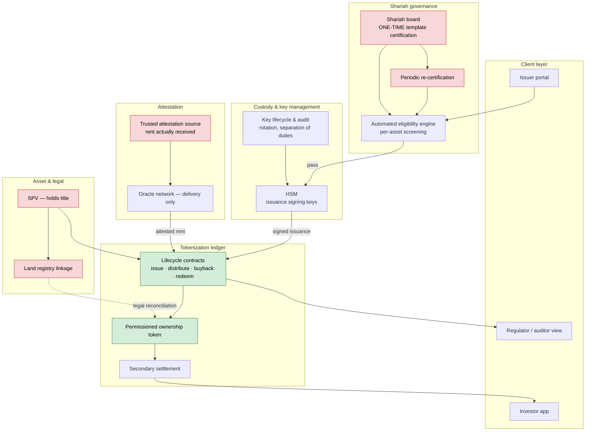
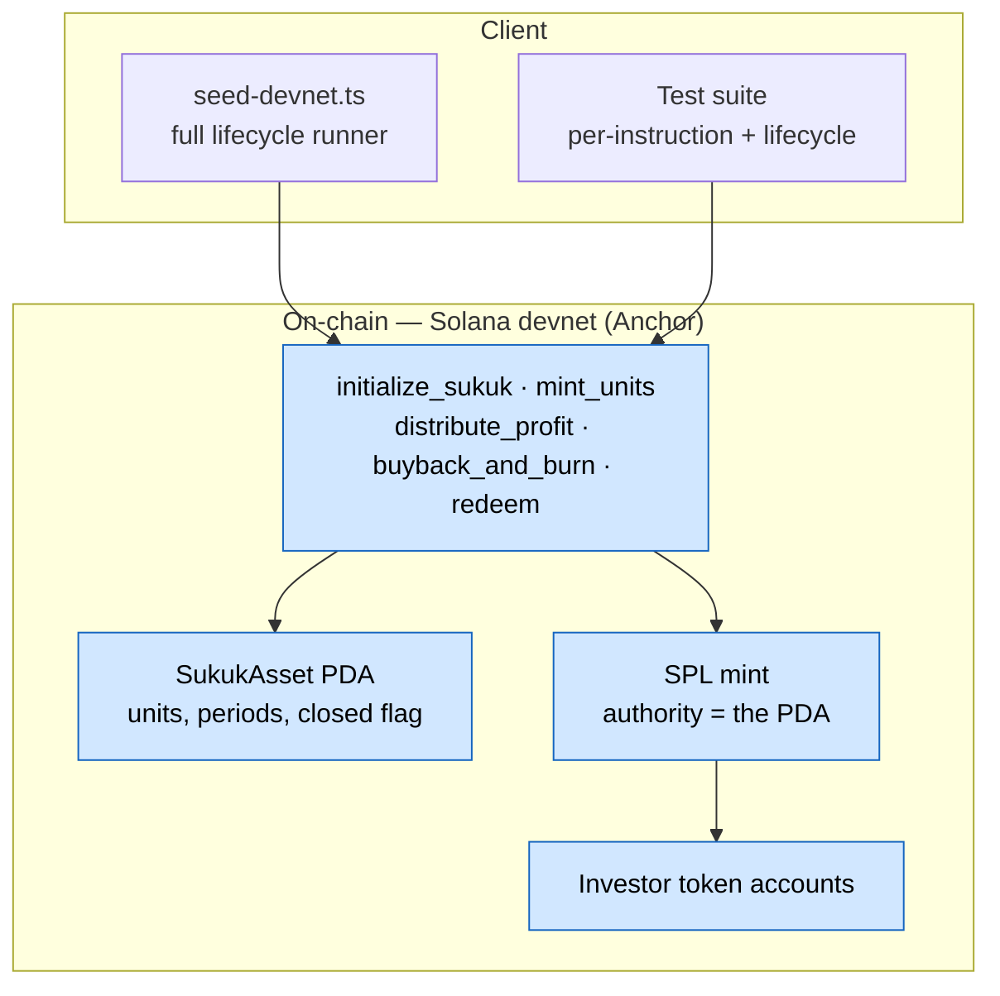

# Tokenized Sukuk — Proof of Concept

A working proof-of-concept for issuing **Sukuk** (Islamic asset-backed securities) as tokens on Solana, designed around an HSM-backed custody layer for the keys that authorise issuance.

> **Scope:** this is a technical proof-of-concept, not a financial product. No real asset, no real capital, no real investors. No Shariah board has certified anything here. Devnet only. See [What this is not](#what-this-is-not).

---

## Live on devnet

**Program:** [`E3qnd2CcmPqfk3BbTD5czpbGr3Bv7BMedriBcCT94pYu`](https://explorer.solana.com/address/E3qnd2CcmPqfk3BbTD5czpbGr3Bv7BMedriBcCT94pYu?cluster=devnet)

A complete lifecycle has been run end to end on devnet. The [Sukuk account](https://explorer.solana.com/address/9psEjm1TiJrKS7BbKbtuWJUYtPLcFYtVzkAyWyHeu7j7?cluster=devnet) shows the final state, decoded from the on-chain IDL: 1000 units issued, 0 outstanding, 2 distribution periods, 17,000,000 lamports distributed, closed.

| Stage | Transaction |
|---|---|
| Issue a 1000-unit Sukuk | [`3Ekw1P…`](https://explorer.solana.com/tx/3Ekw1PRqWLnAjmEo6fkMbuE5wzUPirVfuB2M6sjLgDDpYyVjFwpyBCY1Ssdg8A5mG1oxJpqkeWHKW9fi3FozXgzf?cluster=devnet) |
| Mint 600 units to investor A | [`n93M8G…`](https://explorer.solana.com/tx/n93M8GRQaLTduT2jxFZnREBFnVeGoZ8VDRQdRCFytDucphvQLe8QbKNVSAmeEnmWHYtcfsXyzZpfHFh7aMyjHui?cluster=devnet) |
| Mint 400 units to investor B | [`cwHBmt…`](https://explorer.solana.com/tx/cwHBmtAvGkyyPgZ7UsKamavtUvhbXRGXdoJtmKo1Xc3EXxmaDcq12akvs66sR77iuaT8BtEXtRCvtJHuRxSDajD?cluster=devnet) |
| **Period 1** — distribute 0.01 SOL across a 600/400 split | [`4RPfHJ…`](https://explorer.solana.com/tx/4RPfHJ47FeqUJqJ9f7EPHGPiQdmFNii2UUZEnsSdkV5s2jvW5GUtNRHjUuTAjmRepbG6n12U3s59KgBfvvCnBZxH?cluster=devnet) |
| Buy back 200 units from A | [`242y9q…`](https://explorer.solana.com/tx/242y9qcnbLK2vpLjpLsm5xf4x3pHYaALDvfCpn7YBnUpJHLPYtUCZjXs3T9CK3F1DYvqbiKeYZwv9xEHnJT3K9m2?cluster=devnet) |
| Buy back 100 units from B | [`2KFGNi…`](https://explorer.solana.com/tx/2KFGNiNgDdxo24zQSpRanRudHuRdrNQAA3vrLpRMSzLTomAk2GeYoMch73XxxfPRfAFfBrc6n8KhQC6rVXdophrH?cluster=devnet) |
| **Period 2** — distribute 0.007 SOL across a 400/300 split | [`5Qht9w…`](https://explorer.solana.com/tx/5Qht9wa2qVA7ZZiv88CB3KzbbodGQWfZ7jvVwJGKxo1thzifU9egn5QA6VC95Xmp8p6cVGcC6DpiUgsoAZrSr4Z4?cluster=devnet) |
| Buy back remaining 400 from A | [`2pa4iM…`](https://explorer.solana.com/tx/2pa4iMefiSG8nLcjPU9BnmCzDFGQJvyfHMfB38ZB9SnsDFpwSfXd2ksJDDEHFuzWbcAMHAuhqZFAxXf4HRKkfd1S?cluster=devnet) |
| Buy back remaining 300 from B | [`2tj6jV…`](https://explorer.solana.com/tx/2tj6jVymadyF6dBwht8AF332EtWKxQW67AT3sHVAydBJrSfSuGifZe88CgQeRuk22JM55Q2H5p6EDA4Y5vLPiMFk?cluster=devnet) |
| Redeem and close | [`3xHzQM…`](https://explorer.solana.com/tx/3xHzQMz6b24iWo92HcTVuYWGykLUuioVYC1xuDr4qrUwYLv4c6JKXuYmRB5t3p7NM9LydHhNzjATEQ9KQZF7dC6W?cluster=devnet) |

**Open the two distribution transactions side by side.** Both call the same instruction, both pay the same two wallets, but the split differs — because 300 units were bought back in between. Investor A's share goes from 60% to 57% as her ownership shrinks. That is the Diminishing Musharaka mechanic, visible in raw on-chain data rather than in a diagram.

The [mint account](https://explorer.solana.com/address/CwJVXDc56BpiGAULtspBg54qsGYqj734D2zyJhwALSoo?cluster=devnet) is worth a look too: its mint authority is the program's PDA, not any wallet — so no keypair in existence can mint units. Supply is 0 after redemption.

Reproduce the whole run with `bun run scripts/seed-devnet.ts`.

---

## The problem

Sukuk issuance is slow and manual. A single issuance involves an SPV, an arranger bank, legal counsel, a Shariah board, a registrar and a paying agent — each doing bespoke work, over months. Profit distribution is calculated and paid out by hand on every payment date. Secondary trading is largely over-the-counter and illiquid.

Recent fractional-Sukuk platforms in the UAE have opened retail access, but each bank runs its own closed silo: no shared infrastructure, no interoperable settlement, and no standardised custody layer for the keys that authorise token issuance.

That last gap is what this PoC is built around. Anyone can write a token contract; very few can demonstrate bank-grade key protection behind it.

## What a Sukuk is (for engineers)

A Sukuk is **not a bond**. Interest (*riba*) is prohibited, so investors don't lend money — they own a fractional share of a **real asset** and are paid from the income that asset generates.

This PoC models **Diminishing Musharaka** (lease-ending-in-ownership): the lessee pays rent *and* progressively buys back ownership units. Investor holdings shrink each period until they reach zero and the asset fully reverts.

**The constraint that drives the code:** distributions must be a *pro-rata share of actual rent received*, never a fixed guaranteed return. A hardcoded yield would turn this into interest-bearing debt and break the entire premise. That rule is enforced in `distribute_profit` and is the most important invariant in the program.

## The core idea: certify once, replicate many

A Shariah board certifies the **template** — the contract structure and the smart contract code — one time. Each new asset is then screened by an automated rules engine against the board's pre-approved conditions, rather than going back to the board.

This mirrors how Sukuk programmes and green-Sukuk eligibility frameworks already work, and it's what turns a repeated legal engagement into a repeatable software transaction. It is the scalability argument for the whole design.

---

## Architecture

### Target architecture



Green is what exists today. Red is what cannot be solved with code — Shariah governance, legal structuring, registry linkage, and trusted attestation are relationship and regulatory problems, not engineering ones.

### What is built today



### Planned module layout

```
anchor/   Rust — Anchor program (the on-chain lifecycle)   [built]
api/      TS  — custody signing, eligibility engine        [planned]
web/      TS  — dashboard                                  [planned]
shared/   TS  — shared types, Anchor IDL re-export         [planned]
```

**The custody boundary (planned).** The mint-authority signing key must never be reachable from a browser. `api/` will request a *signature* from the custody service and never handle a raw private key. In production that signer is an HSM over PKCS#11; the pattern is that the key never leaves the vault, only signatures come out. Today the program is called directly with a local keypair — the custody layer is designed, not implemented.

---

## The on-chain program

| Instruction | What it does |
|---|---|
| `initialize_sukuk` | Creates the `SukukAsset` PDA and the SPL mint for one asset |
| `mint_units` | Mints fractional ownership units to an investor |
| `distribute_profit` | Pays a period's rent pro-rata to current holders |
| `buyback_and_burn` | Burns bought-back units — outstanding supply shrinks |
| `redeem` | Closes the instrument once outstanding units reach zero |

### State

`SukukAsset` (one PDA per asset, seeds `[b"sukuk", asset_id]`) holds the issuer, the mint, unit counts, a period counter, cumulative distributions and a closed flag.

`units_issued` and `units_outstanding` are deliberately separate: issued only grows, outstanding shrinks on buyback. Collapsing them would make the Diminishing Musharaka mechanic impossible to represent — and the devnet run above shows why, with issued fixed at 1000 while outstanding walks 0 → 1000 → 700 → 0.

---

## Design decisions

**The PDA is the mint authority, not a wallet.**
`mint::authority = sukuk_asset` means no keypair in existence can mint. The only path is `mint_units`, which runs the unit cap, closed-state and mint-match checks first. Minting authority becomes a capability enforced by program logic rather than a secret to be protected — the security property is structural, not procedural. Verifiable on the [mint account](https://explorer.solana.com/address/CwJVXDc56BpiGAULtspBg54qsGYqj734D2zyJhwALSoo?cluster=devnet).

**`decimals = 0`.**
Ownership units are indivisible; you cannot hold 0.3 of a share. This also removes fixed-point arithmetic from the distribution path.

**Diminishing Musharaka over plain Ijara.**
Both are valid structures. This one was chosen because ownership shrinks progressively rather than terminating in a single event — which makes the instrument's behaviour observable over time rather than only at maturity.

**The eligibility engine is off-chain and deterministic.**
Off-chain to keep the on-chain surface minimal, and deterministic (explicit rules, not judgement calls) because the value of "certify once" depends on the board having approved *specific, auditable conditions*. A probabilistic compliance decision would break the audit trail.

**`u128` intermediates in the distribution maths.**
`rent × holder_units` overflows `u64` at realistic figures. Multiply in `u128`, divide, narrow back. Multiplication precedes division to avoid truncating the ownership fraction to zero.

**`redeem` is state-triggered, not discretionary.**
Gated on `units_outstanding == 0`, so the issuer cannot close early.

---

## Running it

```bash
cd anchor
anchor build
anchor test          # local validator, full suite
```

Seed a fresh lifecycle on devnet:

```bash
ANCHOR_PROVIDER_URL="<your devnet rpc>" \
ANCHOR_WALLET=~/.config/solana/id.json \
bun run scripts/seed-devnet.ts
```

### Tests

| File | Covers |
|---|---|
| `initialize.test.ts` | PDA creation, mint authority, duplicate rejection |
| `mint-units.test.ts` | Minting, unit cap, wrong mint, non-issuer caller |
| `distribute.test.ts` | Pro-rata split, holder/wallet mismatch, malformed holder lists, dust |
| `buyback-redeem.test.ts` | Burn accounting, redeem gating, closed-state enforcement |
| `sukuk.test.ts` | Full lifecycle composed across two periods |

Tests are written against the Anchor client rather than raw instruction encoding, so the patterns carry directly into `api/` and `web/`.

---

## Roadmap

**Next — custody layer (`api/`).** An HSM/KMS-backed signing service holding the mint authority key outside application code, exposing only a sign operation. This is the piece the architecture is built around and the reason the program is structured the way it is.

**Next — eligibility engine (`api/`).** A deterministic rules engine encoding a set of pre-approved conditions, screening each new asset before `initialize_sukuk` is permitted to run. Demonstrates "certify once, replicate many" across several assets, including one that fails screening.

**Then — dashboard (`web/`).** Holdings, distribution history, and a supply chart showing outstanding units shrinking across periods.

**Under consideration:**
- **Allowlist enforcement on-chain** — an allowlist PDA per (sukuk, investor) so `mint_units` can only target screened investors.
- **Token-2022 transfer hooks** — the only way to enforce permissioning at the token level (see limitations below).
- **Pro-rata buyback** — burning proportionally across all holders in one instruction, rather than per holder, which is closer to the real structure.
- **Stablecoin distributions** — rent is currently paid in SOL from the issuer's wallet; production would pay a stablecoin from escrow.

---

## What this is not

Stated plainly, because the scope boundary is what makes the rest credible:

- **No Shariah board has reviewed this.** There is no certified template and no eligibility engine yet — that is roadmap, not implementation.
- **No legal structure.** No SPV, no title, no registry linkage, no real asset.
- **Not regulated.** No VARA/DFSA licensing. This is not an offering.
- **Custody is designed, not built.** The architecture assumes an HSM-backed signer; today the program is called with a local keypair.
- **Rent is an input, not an observation.** `rent_collected` is an instruction argument. Nothing on-chain verifies rent was actually collected.
- **Devnet only.** No mainnet configuration exists in this repo, by design.

### Known unsolved problems

Named rather than hidden, because they're genuine and mostly not code problems:

**The oracle problem.** A chain cannot observe the real world. Whoever attests "rent was received" is a trust dependency that no oracle network removes — oracle infrastructure solves *delivery*, not *truth*. The chain guarantees the split is correct, not that the input is true.

**Title reconciliation.** The token represents ownership; the land registry *is* ownership. If they disagree, the registry wins. Production requires real registry linkage.

**Transfer permissioning.** With a vanilla SPL mint, holders can transfer to any address via the Token Program directly, bypassing the program entirely. Enforcing an allowlist at the token level needs Token-2022 transfer hooks.

**Distribution dust.** Integer division truncates, so distributed totals can fall short of rent collected by up to (holders − 1). Real systems need an explicit remainder policy. There is a test pinning this behaviour rather than papering over it.

**Unbounded holders.** `distribute_profit` iterates holders passed via `remaining_accounts`, bounded by transaction size. Fine for a small demo set; production needs a different mechanism.

**Template scope.** Pre-approval covers the asset *type* it was certified for. A genuinely new asset class needs fresh board review, and real frameworks keep periodic re-certification.

---

## Why this exists

The hard majority of making tokenized Sukuk real is not engineering — it's Shariah governance, legal structuring, regulatory licensing and issuer relationships. This PoC deliberately proves only the part that *is* engineering: that the token lifecycle works, that the instrument's economics can be encoded correctly, and that the issuance path can be structured so that authority is enforced by program logic rather than by protecting a secret.

Everything else is a partnership conversation, not a coding problem.
