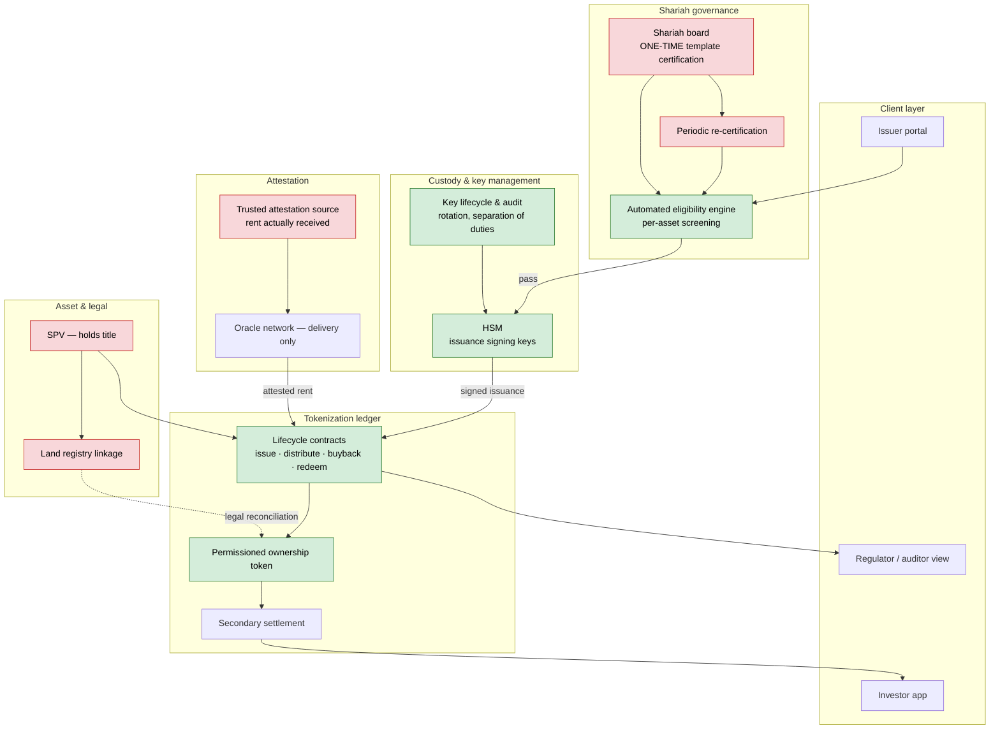
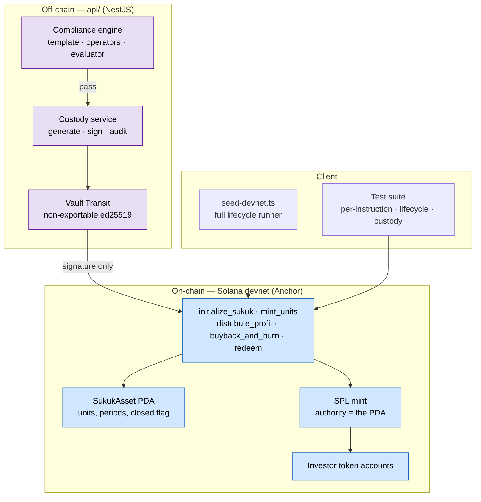

# Tokenized Sukuk — Proof of Concept

A working proof-of-concept for issuing **Sukuk** (Islamic asset-backed securities) as tokens on Solana, built around two things most token demos skip: a custody boundary the issuance key cannot cross, and a deterministic Shariah screening engine that runs before anything is minted.

> **Scope:** this is a technical proof-of-concept, not a financial product. No real asset, no real capital, no real investors. No Shariah board has certified anything here. Devnet only. See [What this is not](#what-this-is-not).

---

## Live on devnet

**Program:** [`E3qnd2CcmPqfk3BbTD5czpbGr3Bv7BMedriBcCT94pYu`](https://explorer.solana.com/address/E3qnd2CcmPqfk3BbTD5czpbGr3Bv7BMedriBcCT94pYu?cluster=devnet)

A complete lifecycle has been run end to end on devnet. The [Sukuk account](https://explorer.solana.com/address/5iY5nVk8Y89eJYDDc2S12qsPSGYKhhD3wEuMXYd33GsY?cluster=devnet) shows the final state, decoded from the on-chain IDL: 1000 units issued, 0 outstanding, 2 distribution periods, 17,000,000 lamports distributed, closed.

| Stage | Transaction |
|---|---|
| Issue a 1000-unit Sukuk | [`1UuoaA…`](https://explorer.solana.com/tx/1UuoaAiD4d3SNwPCp5oqEwc3GxSTWESAiEk75AoU5wPQxSa4gF56wt4Z6vfurkx1ddhUgxRduMz6udVpKC6XjUf?cluster=devnet) |
| Mint 600 units to investor A | [`2yrm2k…`](https://explorer.solana.com/tx/2yrm2kw4W2qU1nwoR5iGesVuRRnxKEczGkx4HSwEyY8UUPKUJHaGmDyHEsALCEJEHcikoiKmf9EGsR6XjGgSxk3z?cluster=devnet) |
| Mint 400 units to investor B | [`3geiKi…`](https://explorer.solana.com/tx/3geiKiJMYC9qNVhoUqLbvZmygWSayL7Px3mCscyVRbDKeqdr7cK6zgg8TMzPGWK6jZwa881HReW37Q4bXjGLLidF?cluster=devnet) |
| **Period 1** — distribute 0.01 SOL across a 600/400 split | [`2ujHUj…`](https://explorer.solana.com/tx/2ujHUj2h2Qc3NoQUN1vJnAXt19BGfFdaXvrEvmKg3n1XSxRTKTizC4HpxGr2699pZeE4MiAbHvJXJsGMTQRpHuxK?cluster=devnet) |
| Buy back 200 units from A | [`UpgUqr…`](https://explorer.solana.com/tx/UpgUqrgwPxxagkvu2sorU5grK39RccoTfaEgt1qRi6AS7R67H7Wd3UzvBfNHZKAzf3vG2Unz6XyktYEcB8pvV7b?cluster=devnet) |
| Buy back 100 units from B | [`ME9yRf…`](https://explorer.solana.com/tx/ME9yRfvJyv6Cktut9SocYwHwMJbvjEn1ZXkcQwkuEBXPAeJ67fagCGWZMwpRfzZyn1cy6pzznGVTMZfFaHvDeBV?cluster=devnet) |
| **Period 2** — distribute 0.007 SOL across a 400/300 split | [`4jgRHx…`](https://explorer.solana.com/tx/4jgRHxydC9FSPFikDXFG1qfiKekPFbokMLAb3VVWoUemze3ohq5L5BZozPb54oQM6Mvu8tZtHtpWSoshvAquNV4W?cluster=devnet) |
| Buy back remaining 400 from A | [`3w5zUP…`](https://explorer.solana.com/tx/3w5zUPXoqyh84KN589Tg1XvcEQJXgavJCc6JF2ybeU32gG7DwQHpcKwL3qW8GrHY7kXbZBYjXcLTzcC7ibhGCXhW?cluster=devnet) |
| Buy back remaining 300 from B | [`Q4mYgg…`](https://explorer.solana.com/tx/Q4mYggx9VHNH9eGcJ7JBWdawjPEanynwCRk921GAXouHQyCPVTa7uqpwJji6UxWFUEpetgDgyHVJiob5T7jQaNi?cluster=devnet) |
| Redeem and close | [`4kqEiR…`](https://explorer.solana.com/tx/4kqEiRdn75htmDVFzwGT1R8zAY5CLWekz5Y3PY34knjDmrhd5jST6Tkn4yaXNq174CWjPrZD93xHzdPdC6JEaDTb?cluster=devnet) |

**Open the two distribution transactions side by side.** Both call the same instruction, both pay the same two wallets, but the split differs — because 300 units were bought back in between. Investor A's share goes from 60% to 57% as her ownership shrinks. That is the Diminishing Musharaka mechanic, visible in raw on-chain data rather than in a diagram.

The [mint account](https://explorer.solana.com/address/cue3U7QuSkatLWkzSyoyn3oTUTDKNARAUZujn4iCJG5?cluster=devnet) is worth a look too: its mint authority is the program's PDA, not any wallet — so no keypair in existence can mint units. Supply is 0 after redemption.

Reproduce the whole run with `bun run scripts/seed-devnet.ts`.

---

## The problem

Sukuk issuance is slow and manual. A single issuance involves an SPV, an arranger bank, legal counsel, a Shariah board, a registrar and a paying agent — each doing bespoke work, over months. Profit distribution is calculated and paid out by hand on every payment date. Secondary trading is largely over-the-counter and illiquid.

Recent fractional-Sukuk platforms in the UAE have opened retail access, but each bank runs its own closed silo: no shared infrastructure, no interoperable settlement, and no standardised custody layer for the keys that authorise token issuance.

That last gap is what this PoC is built around. Anyone can write a token contract; very few can demonstrate bank-grade key protection behind it.

## What a Sukuk is (for engineers)

A Sukuk is **not a bond**. Interest (*riba*) is prohibited, so investors don't lend money — they own a fractional share of a **real asset** and are paid from the income that asset generates.

This PoC models **Diminishing Musharaka** (lease-ending-in-ownership): the lessee pays rent *and* progressively buys back ownership units. Investor holdings shrink each period until they reach zero and the asset fully reverts.

**The constraint that drives the code:** distributions must be a *pro-rata share of actual rent received*, never a fixed guaranteed return. A hardcoded yield would turn this into interest-bearing debt and break the entire premise. That rule is enforced in `distribute_profit` and is the most important invariant in the program.

## The core idea: certify once, replicate many

A Shariah board certifies the **template** — the contract structure and the smart contract code — one time. Each new asset is then screened by an automated rules engine against the board's pre-approved conditions, rather than going back to the board.

This mirrors how Sukuk programmes and green-Sukuk eligibility frameworks already work, and it's what turns a repeated legal engagement into a repeatable software transaction. It is the scalability argument for the whole design.

---

## Architecture

### Target architecture


```mermaid
flowchart TB
    subgraph CLIENTS["Client layer"]
        BANK["Issuer portal"]
        INVESTOR["Investor app"]
        REG["Regulator / auditor view"]
    end

    subgraph SHARIAH["Shariah governance"]
        BOARD["Shariah board<br/>ONE-TIME template certification"]
        ENGINE["Automated eligibility engine<br/>per-asset screening"]
        RECERT["Periodic re-certification"]
    end

    subgraph CUSTODY["Custody & key management"]
        HSM["HSM<br/>issuance signing keys"]
        KMS["Key lifecycle & audit<br/>rotation, separation of duties"]
    end

    subgraph LEDGER["Tokenization ledger"]
        LIFECYCLE["Lifecycle contracts<br/>issue · distribute · buyback · redeem"]
        TOKEN["Permissioned ownership token"]
        SECONDARY["Secondary settlement"]
    end

    subgraph ORACLE["Attestation"]
        ATTEST["Trusted attestation source<br/>rent actually received"]
        ORACLE_NET["Oracle network — delivery only"]
    end

    subgraph LEGAL["Asset & legal"]
        SPV["SPV — holds title"]
        REGISTRY["Land registry linkage"]
    end

    BANK --> ENGINE
    BOARD --> ENGINE
    BOARD --> RECERT
    RECERT --> ENGINE
    ENGINE -->|"pass"| HSM
    KMS --> HSM
    HSM -->|"signed issuance"| LIFECYCLE

    SPV --> REGISTRY
    SPV --> LIFECYCLE
    REGISTRY -.->|"legal reconciliation"| TOKEN

    LIFECYCLE --> TOKEN
    TOKEN --> SECONDARY
    ATTEST --> ORACLE_NET
    ORACLE_NET -->|"attested rent"| LIFECYCLE
    SECONDARY --> INVESTOR
    LIFECYCLE --> REG

    classDef built fill:#d4edda,stroke:#2e7d32,color:#000;
    classDef hard fill:#f8d7da,stroke:#c62828,color:#000;
    class LIFECYCLE,TOKEN,ENGINE,HSM,KMS built;
    class BOARD,RECERT,SPV,REGISTRY,ATTEST hard;
```

Green is what exists today. Red is what cannot be solved with code — Shariah governance, legal structuring, registry linkage, and trusted attestation are relationship and regulatory problems, not engineering ones.

### What is built today


```mermaid
flowchart TB
    subgraph CHAIN["On-chain — Solana devnet (Anchor)"]
        ASSET["SukukAsset PDA<br/>units, periods, closed flag"]
        MINT["SPL mint<br/>authority = the PDA"]
        INV["Investor token accounts"]
        IX["initialize_sukuk · mint_units<br/>distribute_profit · buyback_and_burn · redeem"]
    end

    subgraph API["Off-chain — api/ (NestJS)"]
        SCREEN["Compliance engine<br/>template · operators · evaluator"]
        CUST["Custody service<br/>generate · sign · audit"]
        VAULT["Vault Transit<br/>non-exportable ed25519"]
    end

    subgraph SCRIPTS["Client"]
        SEED["seed-devnet.ts<br/>full lifecycle runner"]
        TESTS["Test suite<br/>per-instruction · lifecycle · custody"]
    end

    SCREEN -->|"pass"| CUST
    CUST --> VAULT
    VAULT -->|"signature only"| IX

    SEED --> IX
    TESTS --> IX
    IX --> ASSET
    IX --> MINT
    MINT --> INV

    classDef chain fill:#d1e7ff,stroke:#1565c0,color:#000;
    classDef off fill:#e8dff5,stroke:#6a1b9a,color:#000;
    class ASSET,MINT,INV,IX chain;
    class SCREEN,CUST,VAULT off;
```

### Module layout

```
anchor/   Rust — Anchor program (the on-chain lifecycle)     [built]
api/      TS  — compliance engine + custody service          [built]
          TS  — sukuk orchestration (screen → sign → submit) [in progress]
web/      TS  — dashboard                                    [planned]
```

---

## Custody

The key that authorises issuance is generated **inside** a security boundary and never crosses back out. The application holds a *handle* — a reference by which it can request a signature — and never holds key material at any point, including briefly at creation.

HashiCorp Vault Transit backs it today. Transit is a real key-management service: keys are created with `exportable: false` and `allow_plaintext_backup: false`, which means no API call can read the private half back out. The application sends a message and receives a signature. That is the same shape as a PKCS#11 HSM call, which is what makes it a stand-in for production hardware rather than a simulation of one.

```
CustodyProvider        interface — generateKey · getPublicKey · sign · healthCheck
VaultCustodyProvider   the only file that knows Vault exists
CustodyService         audit trail, error taxonomy, startup reachability check
```

Three constraints, each load-bearing:

**There is no `exportKey` and no `deleteKey`.** A method that could return key material would defeat the property the module exists to enforce, so the interface does not have one. Deletion is a Vault-admin operation with its own authentication path and is unreachable from this API.

**The interface knows nothing about Solana.** `sign` takes raw bytes and returns raw bytes; transaction assembly belongs elsewhere. Keeping the boundary at "bytes in, bytes out" is what makes the claim precise rather than approximate — and it means a `LunaCustodyProvider` speaking PKCS#11 would implement the same four methods with no consumer changed.

**Non-exportability is re-checked on every read, not trusted from creation.** The check exists to catch a key created out-of-band — by an operator with a curl command, by a restored backup, by a Terraform module written six months from now. A guarantee has to be verified where it matters, not only where it was established.

### The authority never holds funds

Every instruction takes an `authority` that signs and is **never writable**. `initialize_sukuk` has a separate `payer` for account rent; `distribute_profit` has a separate `distributor` that funds the payout. The custody key authorises; other wallets pay.

This is not tidiness. A key inside an HSM has no mechanism to be topped up — if issuance required it to pay rent, the custody boundary would collapse into a hot wallet with extra steps. Because `authority` is not marked `mut`, the Solana runtime itself refuses to debit it. The property is enforced by the validator, not by convention.

`initialize.test.ts` asserts the authority's balance is zero both before and after a full issuance, and `distribute.test.ts` does the same across a distribution. Those tests fail if anyone ever merges the accounts back together.

### Verified, not assumed

`test/custody.spec.ts` runs against a live Vault rather than a mock, because a mocked provider can only confirm assumptions. It proves that signatures verify under Node's RFC 8032 implementation, that signing is deterministic as the specification requires, that a tampered message fails, and that Vault reports the key as non-exportable ed25519 by its own account.

Two findings came out of writing it. Vault rejects `:` in key names at the routing layer with a bare 404 that reads as "no such key," so handles are `issuer-<assetId>` and invalid labels are now rejected up front rather than passed through. And generating an existing key is a no-op rather than a rotation — which matters, because a retried issuance would otherwise orphan the authority already recorded on-chain.

---

## Compliance engine

A deterministic rules engine that screens an asset against a board-certified template before issuance is permitted. No judgement calls, no model inference — explicit conditions, evaluated the same way every time, because the value of "certify once" depends on the board having approved *specific, auditable conditions*.

A template carries a certification block (who certified it, when, when it expires) and a list of conditions over asset fields. Governance is checked before any condition runs: an expired certification fails the asset regardless of its merits.

```
templates/    template shape, operators, certification metadata
compliance/   field-path resolution · 9 operators · evaluator
fixtures/     example assets, including one that fails
```

Three decisions worth naming:

**A missing field fails everything except `exists`.** Absence is not permission. An asset that simply omits `ownership_risk_retained` must not pass a check that the risk is retained.

**All conditions are evaluated; there is no short-circuit.** A result that says "failed at condition 3" is far less useful to an issuer than one listing every condition that failed.

**Operators are a `Record<Operator, OperatorFn>`.** TypeScript refuses to compile if an operator is added to the union without an implementation — the completeness check is structural rather than a test someone has to remember to write.

The criteria are *asset* screens — title, encumbrance, tangibility ratio, tenant activity, ownership risk retained, buyback not at par — not the equity screens (debt ratios, revenue thresholds) that Dow Jones and S&P use for stock indices. Those answer a different question and would be the wrong instrument here.

---

## The on-chain program

| Instruction | What it does |
|---|---|
| `initialize_sukuk` | Creates the `SukukAsset` PDA and the SPL mint for one asset |
| `mint_units` | Mints fractional ownership units to an investor |
| `distribute_profit` | Pays a period's rent pro-rata to current holders |
| `buyback_and_burn` | Burns bought-back units — outstanding supply shrinks |
| `redeem` | Closes the instrument once outstanding units reach zero |

### State

`SukukAsset` (one PDA per asset, seeds `[b"sukuk", asset_id]`) holds the issuer, the mint, unit counts, a period counter, cumulative distributions and a closed flag.

`units_issued` and `units_outstanding` are deliberately separate: issued only grows, outstanding shrinks on buyback. Collapsing them would make the Diminishing Musharaka mechanic impossible to represent — and the devnet run above shows why, with issued fixed at 1000 while outstanding walks 0 → 1000 → 700 → 0.

---

## Design decisions

**The PDA is the mint authority, not a wallet.**
`mint::authority = sukuk_asset` means no keypair in existence can mint. The only path is `mint_units`, which runs the unit cap, closed-state and mint-match checks first. Minting authority becomes a capability enforced by program logic rather than a secret to be protected — the security property is structural, not procedural. Verifiable on the [mint account](https://explorer.solana.com/address/cue3U7QuSkatLWkzSyoyn3oTUTDKNARAUZujn4iCJG5?cluster=devnet).

**Signing authority is separated from funding.**
`payer`, `distributor` and `authority` are distinct accounts. See [the authority never holds funds](#the-authority-never-holds-funds).

**`decimals = 0`.**
Ownership units are indivisible; you cannot hold 0.3 of a share. This also removes fixed-point arithmetic from the distribution path.

**Diminishing Musharaka over plain Ijara.**
Both are valid structures. This one was chosen because ownership shrinks progressively rather than terminating in a single event — which makes the instrument's behaviour observable over time rather than only at maturity.

**The eligibility engine is off-chain and deterministic.**
Off-chain to keep the on-chain surface minimal, and deterministic because a probabilistic compliance decision would break the audit trail that "certify once" depends on.

**`u128` intermediates in the distribution maths.**
`rent × holder_units` overflows `u64` at realistic figures. Multiply in `u128`, divide, narrow back. Multiplication precedes division to avoid truncating the ownership fraction to zero.

**`redeem` is state-triggered, not discretionary.**
Gated on `units_outstanding == 0`, so the issuer cannot close early.

---

## Running it

```bash
cd anchor
anchor build
anchor test          # local validator, full suite
```

Seed a fresh lifecycle on devnet:

```bash
ANCHOR_PROVIDER_URL="<your devnet rpc>" \
ANCHOR_WALLET=~/.config/solana/id.json \
bun run scripts/seed-devnet.ts
```

The API, with Vault running:

```bash
vault server -dev -dev-root-token-id=dev-only-token
vault secrets enable transit

cd api
export VAULT_ADDR=http://127.0.0.1:8200 VAULT_TOKEN=dev-only-token
bun run vitest run test/      # includes live custody integration tests
bun run start:dev
```

### Tests

| File | Covers |
|---|---|
| `anchor/tests/initialize.test.ts` | PDA creation, mint authority, payer/authority split, duplicate rejection |
| `anchor/tests/mint-units.test.ts` | Minting, unit cap, wrong mint, non-issuer caller |
| `anchor/tests/distribute.test.ts` | Pro-rata split, distributor/authority separation, holder mismatch, malformed lists, dust |
| `anchor/tests/buyback-redeem.test.ts` | Burn accounting, redeem gating, closed-state enforcement |
| `anchor/tests/sukuk.test.ts` | Full lifecycle composed across two periods |
| `api/test/evaluator.spec.ts` | Screening against real templates and fixtures loaded from disk |
| `api/test/custody.spec.ts` | Live Vault — signature verification, determinism, non-exportability, error taxonomy |

Tests are written against the Anchor client rather than raw instruction encoding, so the patterns carry directly into `api/` and `web/`.

---

## Roadmap

**Next — `sukuk/` orchestration.** The one module that depends on both compliance and custody: screen the asset, generate the issuer key only on a pass, build the transaction, sign it through custody, submit. Neither existing module imports the other, so "screening passed" and "issuance signed" stay two separately auditable facts.

**Then — bind the two.** Hash the screening result (template ID and version, certification block, per-condition verdicts) and record it both on-chain and in the custody audit trail, so the chain of custody reads: *this signature authorised this issuance, which this screening against this board-certified template permitted*. That is "certify once, replicate many" rendered as evidence rather than as a claim.

**Then — dashboard (`web/`).** Holdings, distribution history, and a supply chart showing outstanding units shrinking across periods.

**Under consideration:**
- **Allowlist enforcement on-chain** — an allowlist PDA per (sukuk, investor) so `mint_units` can only target screened investors.
- **Token-2022 transfer hooks** — the only way to enforce permissioning at the token level (see limitations below).
- **Pro-rata buyback** — burning proportionally across all holders in one instruction, rather than per holder, which is closer to the real structure.
- **Stablecoin distributions** — rent is currently paid in SOL from the distributor's wallet; production would pay a stablecoin from escrow.

---

## What this is not

Stated plainly, because the scope boundary is what makes the rest credible:

- **No Shariah board has reviewed this.** The compliance engine is real and tested; the template it evaluates carries placeholder conditions and a fabricated certification block. The mechanism works — nobody has certified anything.
- **No legal structure.** No SPV, no title, no registry linkage, no real asset.
- **Not regulated.** No VARA/DFSA licensing. This is not an offering.
- **Vault is not an HSM.** It is a real KMS with genuinely non-exportable keys and the same call shape as PKCS#11, which is why the provider swap is a one-line change. It is not tamper-resistant hardware and it is not FIPS-validated.
- **The audit trail is in-memory.** Capped at 1000 entries and lost on restart — a debug buffer, not an audit trail. Production needs append-only storage; this is the part a regulator asks for, and it is worth little if a restart can drop it.
- **Rent is an input, not an observation.** `rent_collected` is an instruction argument. Nothing on-chain verifies rent was actually collected.
- **Devnet only.** No mainnet configuration exists in this repo, by design.

### Known unsolved problems

Named rather than hidden, because they're genuine and mostly not code problems:

**The oracle problem.** A chain cannot observe the real world. Whoever attests "rent was received" is a trust dependency that no oracle network removes — oracle infrastructure solves *delivery*, not *truth*. The chain guarantees the split is correct, not that the input is true.

**Title reconciliation.** The token represents ownership; the land registry *is* ownership. If they disagree, the registry wins. Production requires real registry linkage.

**Transfer permissioning.** With a vanilla SPL mint, holders can transfer to any address via the Token Program directly, bypassing the program entirely. Enforcing an allowlist at the token level needs Token-2022 transfer hooks.

**Screening is not enforced on-chain.** Nothing in the program requires that an asset passed compliance before `initialize_sukuk` runs — that ordering lives in application code today. Recording the screening hash on-chain is the fix, and it is the next piece of work.

**Distribution dust.** Integer division truncates, so distributed totals can fall short of rent collected by up to (holders − 1). Real systems need an explicit remainder policy. There is a test pinning this behaviour rather than papering over it.

**Unbounded holders.** `distribute_profit` iterates holders passed via `remaining_accounts`, bounded by transaction size. Fine for a small demo set; production needs a different mechanism.

**Template scope.** Pre-approval covers the asset *type* it was certified for. A genuinely new asset class needs fresh board review, and real frameworks keep periodic re-certification.

---

## Why this exists

The hard majority of making tokenized Sukuk real is not engineering — it's Shariah governance, legal structuring, regulatory licensing and issuer relationships. This PoC deliberately proves only the part that *is* engineering: that the token lifecycle works, that the instrument's economics can be encoded correctly, that compliance can be applied mechanically against a certified template, and that the issuance path can be structured so authority is enforced by program logic and by a key that cannot leave its boundary.

Everything else is a partnership conversation, not a coding problem.
